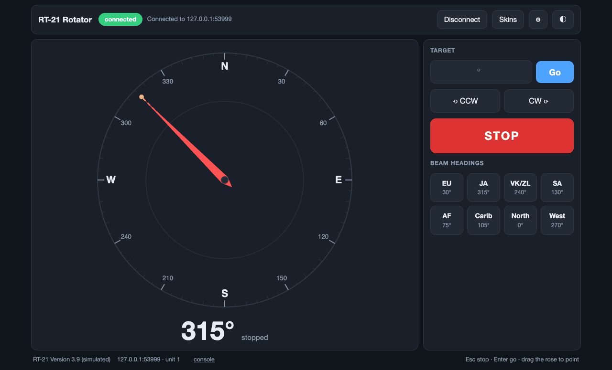

# RT-21 Rotator Controller 3.1 — web edition

A durable, cross-platform client for the Green Heron Engineering RT-21
rotator controller over its network (TCP) port. One Python file, **standard
library only** — no PyQt, no pip installs, no virtual environment, nothing
that can break with an OS update. The interface is a web page served
locally and rendered by whatever browser the machine already has, which also
means you can open it from a phone or tablet in the shack.



History: the original client is `rt21_network_controller.py` (untouched);
version 2.0 was a PyQt6 rewrite (`rt21_controller.py`, still here) whose Qt
platform plugin broke on macOS 26. Version 3.0 keeps 2.0's protocol fixes
and hardened networking core and replaces the GUI toolkit with your browser.

## Running it

```sh
cd ~/Documents/HAM/GreenHeron
./run_rt21.sh                 # starts the app and opens the UI in your browser
```

Windows: double-click `run_rt21.bat`. Or on any OS, just:

```sh
python3 rt21_web.py
```

Useful flags:

| Flag | Effect |
| --- | --- |
| `--demo` | Runs against a built-in RT-21 simulator — no hardware needed |
| `--host 192.168.7.203 --port 6555` | Override the saved connection for one run |
| `--unit 2` | Use rotator digit 2 in every command (`AI2;`, `AP2xxx;`) |
| `--listen 0.0.0.0` | Let phones/tablets on your LAN open the UI too |
| `--http-port 8721` | Change the port the web UI itself listens on |
| `--n1mm` | Accept rotator commands from N1MM Logger+ (see below) |
| `--hamlib` | Run a Hamlib `rotctld`-compatible server on TCP 4533 (see below) |
| `--pst` | Accept PstRotator UDP commands on port 12000 (see below) |
| `--no-browser` | Don't auto-open a browser tab |
| `--reset-config` | Ignore and rewrite the saved settings |
| `-v` | Debug-level logging |

The UI defaults to `http://127.0.0.1:8721/` and only answers on this machine
unless you pass `--listen 0.0.0.0`. There is no login — anyone who can reach
the page can turn the rotator — so only open it up on a network you trust.

## The interface

- **Compass rose** — drag anywhere on it and release to slew; a dashed amber
  needle previews the target while you drag, Esc cancels. The red needle is
  the live heading and turns green while rotating.
- Large heading readout with a live subtitle: `rotating · 34° CCW to 315°`.
- **Target box + Go**, editable **beam-heading buttons** (⚙︎ Settings),
  **jog CCW/CW** (`AAn;` / `ABn;`, 1.5 s re-triggerable) and a large **STOP**.
- **Console** (click "console" in the footer) with an optional wire-traffic
  view showing exactly what goes out and comes back, `<SOH>` and `<CR>`
  rendered readably.
- Dark and light themes (◐), responsive layout for phone screens.
- Shortcuts: **Esc** stop, **Enter** slew.
- Every open browser tab stays in sync — the app pushes updates over
  Server-Sent Events, and a refreshed or reopened page re-syncs instantly.

## Two transports, auto-detected

The app speaks to the RT-21 over whichever link the controller actually has:

- **Raw TCP** — a serial-to-ethernet bridge that passes Appendix F commands
  straight through (one client at a time).
- **GH Everywhere (HTTP)** — the GHE wifi/ethernet box serves a small web
  server (this station: `10.3.0.62:8080`). Commands go out as
  `GET /blank.html?SERIAL_STRING=AI1;` and the last reply frame is read from
  `GET /data.htm` — exactly what Green Heron's own web page does. The bridged
  `R21;` reply carries heading and a status byte (Idle / Busy / No-Motion
  Error / Pot out-of-range / Counter error).

On connect the app probes for the GHE bridge first and falls back to raw TCP;
Settings can pin either. Note the GHE box buffers only the *last* reply, so
polling floors at one second there. If the box's serial link to the RT-21
dies (an unplugged USB cable, say), the stale-data watchdog notices the
missing heading and flags the link instead of showing an empty compass.

## N1MM Logger+ integration

N1MM never speaks the RT-21 protocol itself — when you press **Alt+J** it
broadcasts a small XML packet over UDP port 12040 and expects a separate
"rotator program" to translate. Run this app with `--n1mm` (or set
`"n1mm_enabled": true` in the config file) and it *is* that program:

- Point N1MM at this machine: **Config → Configure Ports… → Broadcast
  Data**, tick **Rotator** and set the address to `<this machine's
  IP>:12040` (the default `127.0.0.1` only works if N1MM runs on the same
  machine).
- Alt+J / callsign-bearing turns go through the same motion director as the
  web UI, so the compass animates every slew N1MM commands. N1MM's `<offset>`
  is honored, `<bidirectional>1` turns to whichever end of the beam is
  nearer, and `<stop>` maps to the RT-21 stop sequence.
- The live heading is reported back to the logger on UDP port 13010 in the
  standard `rotorname @ tenths-of-degrees` form, using the rotor name N1MM
  sent, so N1MM's bearing display tracks the rotator.

Because the RT-21 link has exactly one owner (this app), N1MM control works
over the GHE bridge too — no fighting over the GHE box's one-reply buffer,
which is what breaks running two rotator programs side by side. Note the
UDP port accepts commands from any machine on the network while enabled,
which is the point — but only enable it on a network you trust.

## Hamlib and PstRotator

Any program that can drive a rotator through Hamlib's network backend
(GPredict, WSJT-X helpers, loggers, `rotctl` itself) can steer the RT-21
through this app. Enable it with `--hamlib` or the settings dialog and point
the client at `<this machine>:4533`, model 2 (`NET rotctl`):

```sh
rotctl -m 2 -r 127.0.0.1:4533 P 245 0     # turn to 245°
rotctl -m 2 -r 127.0.0.1:4533 p           # read the heading
rotctl -m 2 -r 127.0.0.1:4533 S           # stop
```

Supported: `P`/`\set_pos`, `p`/`\get_pos`, `S`/`\stop`, `K`/`\park`,
`M`/`\move` (CW/CCW, mapped to the RT-21's 1.5 s jog), `_`/`\get_info`,
`\dump_state`, and the `+` extended response mode. Elevation is accepted and
ignored. Up to four clients at once (`hamlib_max_clients`).

PstRotator-style UDP control is enabled with `--pst`:

```sh
echo '<PST><AZIMUTH>85</AZIMUTH></PST>' | nc -u -w1 127.0.0.1 12000
echo '<PST><STOP>1</STOP></PST>'        | nc -u -w1 127.0.0.1 12000
echo '<PST>AZ?</PST>'                   | nc -u -w1 127.0.0.1 12000  # "AZ:85\r" to port 12001
```

### Who wins when several programs steer

Every source (web UI, N1MM, Hamlib, PstRotator) goes through one motion
director that holds a single pending command, not a queue. The latest
target replaces any older one, even mid-move; a stop replaces anything and
goes out first; a burst of retargets reaches the controller as one command.
The readout shows who set the current target (`→ 245° · N1MM`) and the log
records every change (`Target 245° from N1MM (was 090° from Hamlib)`).

The RT-21 ignores a new target that arrives while its motor is running, and
enforces its DELAYS setting (1–6 s, default 3) before it will reverse. So a
retarget during a move (`retarget_mode: stop_first`, the default) sends a
stop, waits for the controller to report "stopped", waits
`retarget_settle_ms` more (default 3.5 s — set it at or above your DELAYS),
then turns. The same wait applies when any program sends a stop and then a
new target straight away. A target that produces no motion within 6 s is
re-sent once. `direct` sends the new target immediately, for controllers
that accept it mid-move.

`park_heading` is unset by default, so park requests are refused
(Hamlib `K` returns `RPRT -11`). Set it in the settings dialog to enable
park.

All three listeners bind to every interface by default (`n1mm_bind`,
`hamlib_bind`, `pst_bind`), and none needs a password — enable only
the ones you use, on a network you trust. Settings changes start or stop
listeners immediately; no restart needed.

## Protocol corrections (inherited from 2.0)

The original client's commands did not match RT-21 Manual Appendix F:

| Action | Old client sent | Correct command | Consequence of the old form |
| --- | --- | --- | --- |
| Slew to heading | `AP1AM045;` | `AP1045<CR>;` | Malformed — the immediate-move form requires a carriage return before the semicolon |
| Keep-alive poll | `AM1;` every 2 s | `AI1;` (+ `R21;`) | **`AMn;` means "move to the last AP target"** — the heartbeat was re-commanding a move twice a second |
| Stop | `A;` | `;` then `ST1;` | `A;` is not a command; the emergency stop did nothing |
| Heading reply | looked for `AZ=245` | bare `xxx;` | The RT-21 never sends `AZ=`, so the display only updated by accident |

The client polls `AIn;` for heading (the one reply with no SOH prefix, so it
is unambiguous on every firmware) and `R2n;` for heading plus running/stopped
status (SOH-prefixed, so the two replies can never be confused). If a
controller ignores `R2n;`, the app keeps working and simply shows no motion
state.

## What makes it durable

- **One thread owns the socket.** Commands go through a bounded queue; the
  HTTP layer never touches the connection to the RT-21.
- **Automatic reconnect** with exponential backoff (1 s → 15 s), forever, so
  a switch reboot or a dropped Wi-Fi link heals itself.
- **Stale-data watchdog.** If no heading arrives for 6 s the link is torn
  down and rebuilt, which catches the half-open TCP connection that a plain
  read timeout never notices.
- **Bounded buffers.** Unterminated input past 4 kB is discarded; the console
  keeps the last 400 lines; a stalled browser tab drops events rather than
  ever blocking the rotator link.
- **Input validation** on headings, ports and every value in the config file,
  plus same-origin checks on every command the UI sends.
- **The UI cannot take the app down.** Close the browser, open five tabs,
  refresh mid-slew — the worker thread neither knows nor cares.
- **Clean shutdown** on Ctrl-C: HTTP server closed, worker joined, simulator
  stopped.

## Where things live

| | macOS |
| --- | --- |
| Settings | `~/Library/Preferences/GreenHeron/RT-21 Controller/config.json` |
| Logs | `~/Library/Application Support/GreenHeron/RT-21 Controller/logs/rt21.log` |

Windows uses `%APPDATA%` / `%LOCALAPPDATA%`, Linux `~/.config` / `~/.local/share`.
The config file is shared with the 2.0 client; keys the web edition does not
use are preserved. Logs rotate at 1 MB, five files kept.

## Verification

`test_web.py` runs the whole stack headless against built-in simulators for
both transports (raw TCP and an emulated GHE bridge) —
protocol encoding, SOH/bare frame decoding, config clamping, connect, poll,
slew, stop, out-of-range and cross-origin rejection, the SSE stream, the
stale-link watchdog, drop-and-reconnect, and clean thread shutdown:

```sh
python3 test_web.py
```

The suite also emulates N1MM Logger+, Hamlib clients and PstRotator over
real sockets: latest-command-wins overrides between sources, burst
coalescing, stop priority, the Hamlib client cap and malformed input, the
PstRotator reply port, listener restarts, and clean shutdown.

80 tests, ~50 s, no dependencies; passes on Python 3.9 through 3.14. The
Hamlib server was also checked with Hamlib 4.5.5's own `rotctl -m 2`. Also verified live against the real RT-21
(firmware 4.13.2) through its GH Everywhere interface: connect, poll, slew,
motion status and return-to-heading all confirmed end to end.
