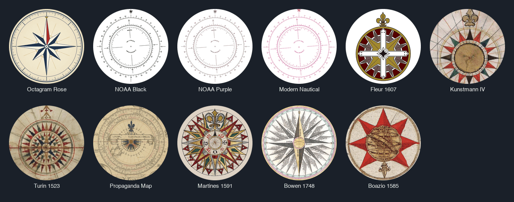
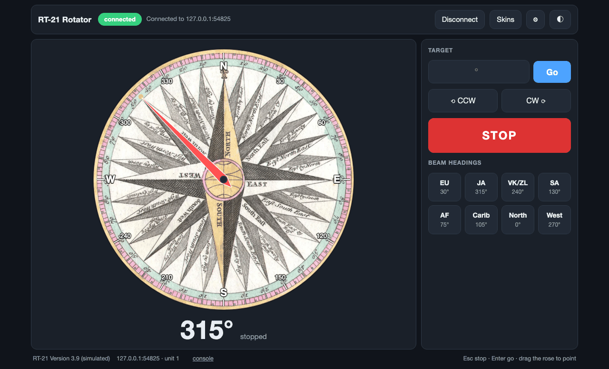

# Dial skins

A skin is a picture of a compass rose drawn behind the app's dial. The scale,
degree labels, target marker and heading needle are still drawn live on top, so
nothing about steering changes. Pick one with the **Skins** button in the
header; the choice is saved in `config.json` (`skin`, and `skin_overlay` for the
degree scale) and is shared by every browser tab.





## What ships

Eleven skins in `skins/`, each one a single `<id>.webp`:

| Kind | Skins |
| --- | --- |
| Vector (rendered from SVG) | `octagram-rose` (original 8-point rose, CC0), `noaa-black`, `noaa-purple`, `modern-nautical`, `fleur-1607` |
| Historic charts and engravings | `kunstmann`, `turin-1523`, `propaganda-map`, `martines-1591`, `bowen-1748`, `boazio-1585` |

`skins/skins.json` is the generated index the app reads (id, display name,
credit, license, source URL). `skins/sources.json` is the hand-edited recipe
that produces it.

## The format, and why

| | |
| --- | --- |
| Container | WebP, lossy, quality 82. Every current browser decodes it, and it is typically much smaller than JPEG at similar quality. |
| Size | 800 × 800 px, square. The dial is at most 560 CSS px wide, so this stays sharp on a 1.4× display and acceptable at 2×. Per-skin cap in tests: 300 KB. |
| Framing | The rose is centred and fills the frame. The app clips the image to a circle, so square corners never show. |
| Metadata | None. EXIF, ICC and XMP chunks are not written (no camera, GPS or editor data in the repo). |
| Colour | Flattened to opaque RGB. Vector art is composited on white. |

The 11 skins total about 0.95 MB. Third-party originals (up to ~2 MB each) are kept
out of git in `skins/raw/`; our own source art (`octagram-rose.svg`) is committed
in `skins/art/`.

## Rebuilding or adding a skin

```sh
python3 -m venv .venv-tools && . .venv-tools/bin/activate
pip install -r tools/requirements.txt      # Pillow + resvg-py, build-time only
```

1. Put the original in `skins/raw/` (or, for art you made yourself, `skins/art/`,
   which is committed). SVG, JPEG, PNG and WebP all work. The build looks in
   `art/` first, then `raw/`.
   Check it is really an image: a "Save as" from a Wikimedia *File:* page saves
   the HTML page, not the picture. Use the "Original file" link.
2. Add an entry to `skins/sources.json`:

   ```json
   {"id": "my-rose", "name": "My Rose", "file": "my-rose.jpg",
    "credit": "Author", "license": "CC0", "source": "https://…",
    "center": [0.5, 0.5], "span": 0.9}
   ```

   - `id`: lowercase letters, digits, dashes. It becomes the filename and the
     URL (`/skins/my-rose.webp`).
   - `center` and `span` (rasters): the crop's centre, and its side, as fractions
     of the image width/height and of the shorter side. Defaults: `[0.5, 0.5]`
     and `1.0`. Aim to make the rose fill the crop, with north at the top.
   - `trim` and `margin` (vector art): crop to the artwork's bounding box, then
     pad to a square with that fractional margin.
   - `credit`, `license` and `source` are required. Do not add a skin whose
     license you cannot state, and keep attribution accurate: CC BY and
     CC BY-SA need it in the UI, which the credit line already shows.
3. Build and look at the result:

   ```sh
   python3 tools/make_skins.py --only my-rose   # one skin
   python3 tools/make_skins.py --gallery        # everything, regenerate skins.json and the gallery image
   python3 tools/make_skins.py --check          # validate sources.json only
   ```
4. `python3 test_skins.py` checks that the index and files agree, every skin is
   800 × 800, under budget and metadata-free, and that every skin is credited.

Commit `skins/*.webp`, `skins/skins.json`, `skins/sources.json` and any `skins/art/`
file. `skins/raw/` is git-ignored.

The screenshots in `docs/` (`screenshot.png`, `screenshot-skin.png`) are taken
by hand against the demo simulator (`python3 rt21_web.py --demo`) at 1280 × 775;
retake them when the UI changes.

## How the app serves them

- `GET /api/skins` lists the skins that are in `skins.json` **and** on disk.
- `GET /skins/<id>.webp` serves one. Only ids from that list are served, so no
  request can name an arbitrary file (`../`, `sources.json` and `raw/` all 404).
- `POST /api/config {"skin": "<id>"}` selects one; an unknown id is rejected
  (400). `""` returns to the classic drawn rose.
- Images are cached for a day (`Cache-Control: public, max-age=86400`). If you
  replace a skin's image, hard-refresh to see it.

## Licensing and provenance

All eleven shipped skins are public domain or CC0; the credit and source for each
is in `skins.json` and appears in the picker. Four photographs (three from
Flickr, one from Pixabay) were removed because their licenses could not be
confirmed. Only add a skin whose license you can state.
